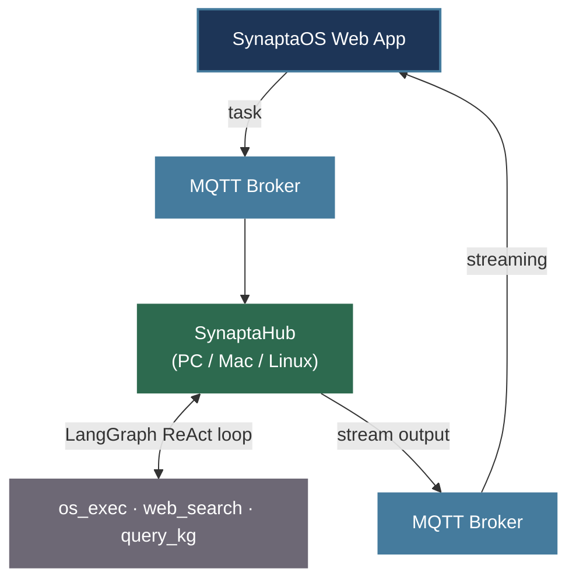

# SynaptaHub

Python agent สำหรับระบบ [SynaptaOS](https://github.com/Ninlapat5G/SynaptaOS-V0) — รันบน PC/Mac/Linux แล้วให้ AI สั่งงานเครื่องผ่านภาษาธรรมชาติ

---

## How it fits



---

## Installation

```bash
git clone https://github.com/Ninlapat5G/SynaptaHub-V0.git
cd SynaptaHub-V0
pip install -r requirements.txt
cp .env.example .env
```

แก้ไขค่าใน `.env`:

```env
LLM_API_KEY=your_api_key
LLM_BASE_URL=https://api.opentyphoon.ai/v1
LLM_MODEL=typhoon-v2.5-30b-a3b-instruct

MQTT_BROKER=broker.hivemq.com
MQTT_PORT=1883
MQTT_BASE_TOPIC=home/smarthome
AGENT_NAME=my-hub
```

รัน:

```bash
python agent.py
```

---

## Build เป็น .exe (Windows)

```bash
pip install -r requirements_builder.txt
python build_gui.py
```

GUI จะขึ้นมาให้กรอก settings → กด Build → ได้ `dist/SynaptaHubAgent.exe`

---

## Tools ที่ Agent ใช้

| Tool | ทำอะไร |
|------|--------|
| `os_exec` | รัน shell command บนเครื่อง |
| `web_search` | ค้นข้อมูลจากอินเทอร์เน็ต (Serper API) |
| `query_kg` | refresh สถานะเครื่องสด (RAM, disk, CWD) |

เพิ่ม tool ใหม่: สร้าง `tools/<name>.py` แล้วลงทะเบียนใน `runner.py _make_tools()`

---

## MQTT Topics

| Topic | Direction | Description |
|-------|-----------|-------------|
| `{base}/hub/{name}/cmd` | Web App → Hub | รับ task (แนบ MQTT 5 ResponseTopic) |
| `{base}/hub/{name}/cancel` | Web App → Hub | ยกเลิก task ที่รันอยู่ |
| `{base}/hub/{name}/status` | Hub → Web App | `online` (retained) / `offline` (Last Will) |

**Reply (MQTT 5):** คำตอบส่งกลับที่ `ResponseTopic` ของแต่ละ request โดยใช้ user property `stream_status`:
`ping` (heartbeat กันตัวจับเวลาหมดระหว่างงานยาว) · `chunk` (ผลลัพธ์) · `end` (จบ stream)

---

## License

GPL v3
